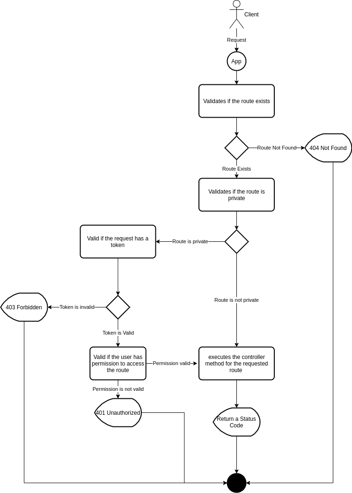

### perlmvc-webapi

### Author
   >Renan Alves da Silva  
   >Mail: renan.silva@kabum.com.br
  

## Description
   >This framework was developed to support Web Apis rest based on the PERL language. It is possible to create friendly routes, validate requests recursively with DO's, return responses with status code and validate data models.

## Dependencies

> Docker Install: https://docs.docker.com/engine/install/ubuntu/;

> Docker Compose install: https://docs.docker.com/compose/install/;

## Initialize
> docker-compose up -d

## Architecture

**Startup Diagram:**
  

